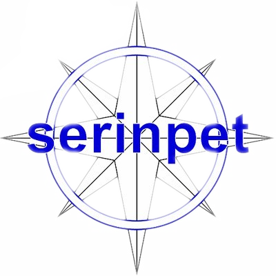
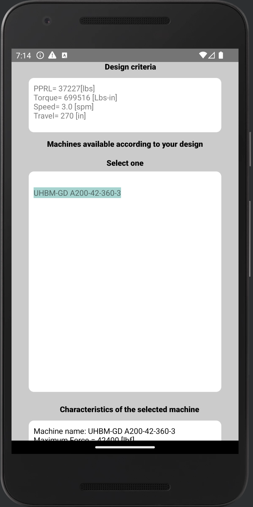

# SerinpetAPP: Advanced Oil Well Calculation Application

SerinpetAPP is a cutting-edge mobile application meticulously designed for the precise calculation of oil wells, employing the industry-standard API RP11 method. Developed using a blend of Kotlin and Java, this application seamlessly integrates multiple mathematical procedures, sophisticated data management, PDF functionality, and in-storage saving capabilities.

## About the Developer

Hi, I'm Lennin Sabogal, the developer behind SerinpetAPP. With a passion for cutting-edge technology and a background in mobile development, I've dedicated myself to creating a powerful and secure solution for oil well calculations.

## Development Status

SerinpetAPP is currently in active development, with a unwavering dedication to delivering frequent updates and improvements comming in the future. The app is soon will be free to download in the Play Store, but some features are exclusive to the Serinpet clients.

## Privacy and Security

Due to the sensitive nature of the calculations involved and to protect proprietary information, the source code and specific calculation details of SerinpetAPP are kept private. Rest assured, this commitment to privacy is in place to safeguard the confidentiality of the application's functionality.

## The process

  
  

### PI RP11 Methodology:

SerinpetAPP utilizes the API RP11 method, a widely recognized industry standard for oil well calculations. This ensures high accuracy and reliability in assessing crucial well parameters without compromising on confidentiality.

    
    

## Advanced Mathematical Procedures:

SerinpetAPP incorporates a suite of advanced mathematical procedures to perform intricate calculations required for oil well analysis. These procedures work seamlessly behind the scenes, providing users with accurate and dependable results.

    
    

### Robust Data Management:
The application features robust data management capabilities, ensuring efficient handling and organization of critical information related to oil well calculations. It also provides users with the flexibility to select any machine of their choice from Serinpet's list of hydraulic pumping units.

### PDF Functionality & In-Storage Saving:

SerinpetAPP enables users to generate and save PDF reports, offering a convenient way to document and share the calculated results securely. With in-storage saving functionality, the application allows users to securely store and retrieve important data related to oil well calculations, ensuring a seamless and confidential user experience.

